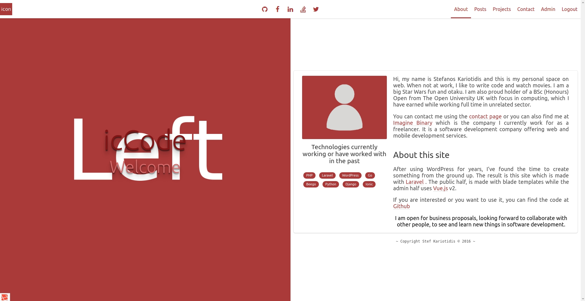

# Blog

A simple, small, Markdown powered blog engine for personal sites & portfolios,
made with Laravel.

## Demo

Check https://stefk.me

## Features

* Blog posts types
* Portfolio posts types
* Tags
* Google Analytics integration
* Disqus commenting system integration
* Contact form SMTP mail
* Google Recaptcha form protection
* [Micro](https://www.w3.org/TR/microdata/) data ready for posts,
[read here](https://developers.google.com/search/docs/data-types/articles)

## Built with

* [Laravel](https://laravel.com/) 5.3
* [Vue.js](https://vuejs.org/) 2.1
* [Bulma](http://bulma.io/) 0.3.1 CSS framework
* No jQuery to be as light as possible

The frontend is built with Laravel's blade templates,
while the backend is built using Vue.

## Installation

### Site variables

See `.env.example` for relevant data (Email settings, user info, site URL, etc)
and copy them into `.env` file.

### Before running migrations

Go to `blog/config/app.php` and comment out the following:

` App\Providers\SettingsProvider::class,` in providers

`'Settings' => App\Providers\SettingsProvider::class,` in aliases

run `php artisan migrate`

### Admin user

There is no user registration, user is being created with `php artisan db:seed`
based on the info typed into `.env` file.

In application's backend you can change user's info, password, etc.

### Admin dashboard

Visit `example.com/admin` to login to backend

### Site images - logo

Inside `blog/public/img/` directory you will find:

* `left.jpg` the image for the landing page
* `me.jpg` the image of you for the landing page
* `icon.png` the image used in navbar and as favicon

replace them with yours.
